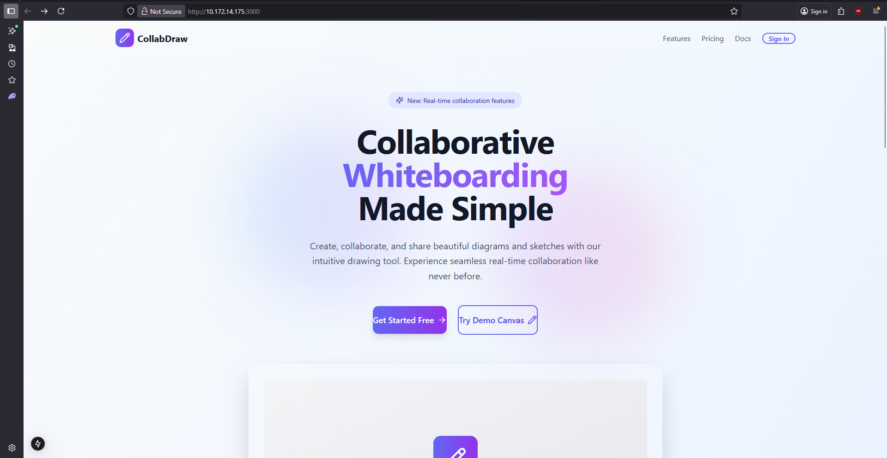
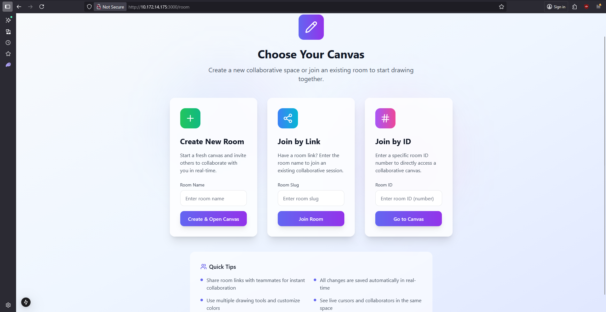
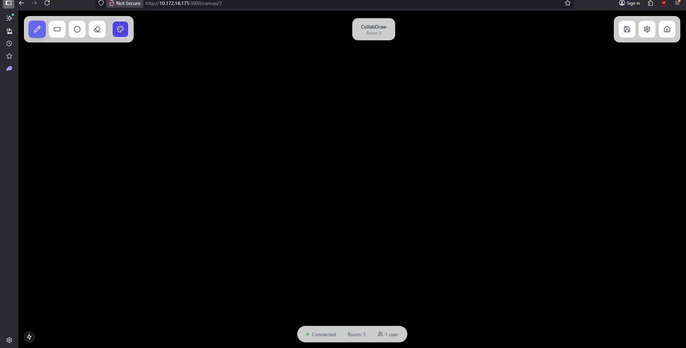

# 🎨 CollabDraw - Real-time Collaborative Whiteboard

[](https://nextjs.org)
[](https://typescriptlang.org)
[](https://prisma.io)
[](https://developer.mozilla.org/en-US/docs/Web/API/WebSocket)
[](https://tailwindcss.com)

A real-time collaborative whiteboard: create rooms, share a link, and draw together with live user count.

## 📸 Screenshots

### 🏠 Landing Page


### 🔐 Authentication


### 🎨 Drawing Canvas


## ✨ Features

- Real-time collaboration across multiple users in the same room
- Live user count per room
- Create/join rooms by name (slug) or numeric room ID
- Drawing tools: pencil (with width), rectangle, circle, eraser
- Color picker with 16 presets
- JWT-based auth with bcrypt password hashing

## 🏗️ Architecture

```
├── apps/
│   ├── excelidraw-frontend/     # Next.js 15 frontend (port 3002)
│   ├── http-backend/            # Express REST API   (port 3001)
│   └── ws-backend/              # WebSocket server    (port 8081)
├── packages/
│   ├── db/                      # Prisma schema + client
│   ├── common/                  # Shared Zod schemas
│   ├── backend-common/          # Shared backend config (JWT_SECRET)
│   ├── ui/                      # Shared UI components
│   └── typescript-config/       # Shared tsconfig presets
```

Backends run directly from TypeScript via [`tsx`](https://tsx.is) — no compile step required for local dev.

## 🛠️ Technology Stack

**Frontend**: Next.js 15, React 19, TypeScript, Tailwind CSS, HTML5 Canvas
**Backend**: Express, `ws`, JWT, bcrypt
**Database**: PostgreSQL via Prisma
**Monorepo**: Turborepo + npm workspaces (`tsx` for backends)

## 🚀 Quick Start

### Prerequisites
- Node.js **≥ 18**
- npm (bundled with Node) — **do not use pnpm/yarn; only npm is supported**
- A reachable PostgreSQL instance

### 1. Install dependencies

From the repo root:

```bash
npm install
```

This installs every workspace (frontend, backends, shared packages) at once.

### 2. Configure environment variables

Copy the example env files and fill in real values.

```bash
cp packages/db/.env.example           packages/db/.env
cp apps/http-backend/.env.example     apps/http-backend/.env
cp apps/ws-backend/.env.example       apps/ws-backend/.env
cp apps/excelidraw-frontend/.env.example apps/excelidraw-frontend/.env.local
```

On Windows PowerShell, use `copy` instead of `cp`.

Required values:

| File                                     | Variables                                             |
| ---------------------------------------- | ----------------------------------------------------- |
| `packages/db/.env`                       | `DATABASE_URL`                                        |
| `apps/http-backend/.env`                 | `PORT` (3001), `JWT_SECRET`, `DATABASE_URL`           |
| `apps/ws-backend/.env`                   | `PORT` (8081), `JWT_SECRET`, `DATABASE_URL`           |
| `apps/excelidraw-frontend/.env.local`    | `NEXT_PUBLIC_HTTP_BACKEND`, `NEXT_PUBLIC_WS_URL`      |

> **Important:** `JWT_SECRET` must match between `http-backend` and `ws-backend`. There is no insecure fallback — missing `JWT_SECRET` will crash the backend on startup.

### 3. Initialize the database

```bash
npm run db:generate   # generate Prisma client
npm run db:push       # push schema to your Postgres database
```

### 4. Start everything in dev mode

```bash
npm run dev
```

Turbo starts all three services with file watching:

- Frontend → http://localhost:3002
- HTTP API → http://localhost:3001
- WebSocket → ws://localhost:8081

To stop: `Ctrl+C` in the terminal.

### Optional: start individual services

```bash
npm run dev --workspace=excelidraw-frontend
npm run dev --workspace=http-backend
npm run dev --workspace=ws-backend
```

## 📱 How to Use

1. Go to http://localhost:3002 and sign up.
2. Sign in; you'll be redirected to the Rooms page.
3. **Create New Room** → enter a name → redirected to `/canvas/<roomId>`.
4. Share the room ID (or slug) with another user; they can use **Join by ID** or **Join by Link**.
5. Draw together — the user count bottom-center reflects everyone connected.

### Drawing Tools

- **Pencil** — freehand, adjustable width
- **Rectangle** — click-drag
- **Circle** — click-drag
- **Eraser** — click a shape to remove it
- **Color Picker** — 16 presets

## 🔧 Available Scripts (root)

```bash
npm run dev           # Run all apps in dev (Turborepo)
npm run build         # Build all apps that have a build script (frontend)
npm run lint          # Lint workspaces that have a lint script
npm run format        # Prettier format
npm run db:generate   # Prisma generate
npm run db:push       # Prisma db push
npm run db:migrate    # Prisma migrate dev
```

## 🔒 Security Notes

- Passwords are hashed with bcrypt (10 rounds) before storage.
- `JWT_SECRET` must be set; the backend refuses to boot without it.
- WebSocket connections are authenticated by a `?token=<jwt>` query parameter.
- JWT verification is wrapped in try/catch — invalid/expired tokens return 403 instead of crashing the server.

## 📄 API

### Auth
```
POST /signup { username, password, name }  → { userId }
POST /signin { username, password }        → { token }
```

### Rooms
```
POST /room       (auth required) { name } → { roomId }
GET  /room/:slug                          → { room }
GET  /room/id/:id                         → { room }
GET  /chats/:roomId                       → { messages }
```

### WebSocket (`ws://…:8081?token=<jwt>`)
```ts
// client → server
{ type: "join_room", roomId }
{ type: "leave_room", roomId }
{ type: "chat", roomId, message }   // carries drawing add/delete payload

// server → client
{ type: "user_count", roomId, count, users }
{ type: "chat", roomId, message, userId }
```

Drawing shapes are sent as `chat` messages with JSON payloads `{ action: "add" | "delete", … }` so that history can be rebuilt on reconnect via `GET /chats/:roomId`.

## 🧩 Troubleshooting

- **`JWT_SECRET is not set`** — create `apps/http-backend/.env` and `apps/ws-backend/.env` from the examples.
- **`Can't reach database server`** — verify `DATABASE_URL` in every `.env` that needs it (db package, http-backend, ws-backend) and that Postgres is running.
- **Port already in use** — override `PORT` in the relevant `.env`, and update the frontend's `NEXT_PUBLIC_HTTP_BACKEND` / `NEXT_PUBLIC_WS_URL` accordingly.
- **Changes to shared packages don't reflect** — backends watch their own `src/`; shared packages are loaded at import time. Restart the affected backend if you edit `packages/common` or `packages/backend-common`.

## 📞 Contact

- **Email**: vineeta.garwal54@gmail.com
